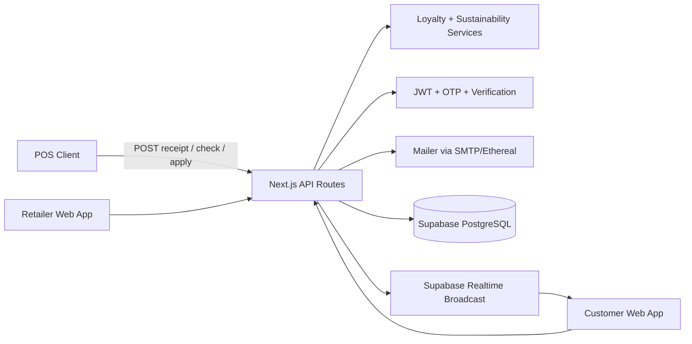

# Raseed System Design

## 1. System Context
Raseed is a full-stack web platform that sits between retail POS systems and end-user dashboards:
- Inbound side: POS calls backend APIs to create receipts and redeem discounts.
- Internal processing: backend updates loyalty, discount, feedback, analytics, and sustainability datasets.
- Outbound side: customer and retailer web dashboards consume APIs for operational and insight views.

Core objective: convert post-purchase transaction events into customer engagement and retailer intelligence.

## 2. High-Level Architecture

## 3. Runtime Components

### 3.1 Frontend Layer
- Next.js App Router pages for:
  - public landing and auth flows.
  - customer dashboard modules (home, receipts, rewards, sustainability, feedback).
  - retailer dashboard modules (overview, loyalty rules, receipts, feedback, sustainability, profile).
- React Query handles async server state and cache invalidation.
- Shared UI system with shadcn-compatible components and Tailwind theme tokens.

### 3.2 API Layer
- Implemented through Next.js route handlers under app/api.
- Responsibilities:
  - request validation and parsing.
  - entity CRUD and relational reads.
  - auth token issuance/verification.
  - orchestration of service-level business logic.

### 3.3 Service Layer
- loyaltyService:
  - reads customer loyalty state and retailer rules.
  - decides eligibility conditions.
  - issues discount records with expiry.
- sustainabilityService:
  - computes paperSavedCount from receipt totals.
  - derives estimatedCarbonSaved using fixed emission factor.
  - upserts SustainabilityStats record.

### 3.4 Data Layer
- Supabase client is used for database interactions.
- Existing Prisma schema documents relational model and was used with migration tooling.
- Current runtime path indicates Supabase-centric access.

## 4. Domain Model and Relationships

Key relationships:
- Retailer 1..* Branch
- Retailer 1..* Receipt
- Customer 1..* Receipt
- Receipt 1..* ReceiptItem
- Retailer 1..* LoyaltyRule
- Customer *..* Retailer via CustomerLoyalty
- Customer 1..* Discount (scoped to retailer)
- Receipt 1..* Feedback
- Retailer 1..1 SustainabilityStats

Entity behavior notes:
- Customer can be auto-provisioned on first POS interaction by email.
- Discount status lifecycle: AVAILABLE -> USED (and conceptually EXPIRED via time checks).
- Sustainability stats are synchronized from canonical receipt totals.

## 5. Authentication and Authorization Design

### 5.1 Customer Auth
- Email OTP flow:
  - send OTP endpoint generates/store code and dispatches email.
  - verify OTP endpoint validates code and issues JWT.
- New customer auto-created if absent.

### 5.2 Retailer Auth
- Registration flow:
  - store name + email submission.
  - verification token hash stored with expiry.
  - email link verification endpoint marks account verified.
  - short-lived onboarding token used for password setup.
- Login uses bcrypt hash comparison and returns JWT.

### 5.3 Session Model
- JWT persisted in localStorage by role.
- API helper attaches bearer token to requests.
- Dashboard layouts enforce client-side token presence and redirect when missing.

## 6. Core Data Flows

### 6.1 Receipt Ingestion (POS)
1. POS submits receipt payload with retailer/branch/customer and items.
2. Backend resolves customer by email (create if missing).
3. Receipt and receipt items are inserted.
4. CustomerLoyalty counters are upserted/updated.
5. Sustainability stats synchronization is triggered.
6. Loyalty evaluation generates discounts when thresholds are met.
7. Realtime event broadcast attempts notify customer channel.

### 6.2 Discount Lifecycle
1. POS checks available discounts by customer email + retailer id.
2. Backend returns AVAILABLE and unexpired discounts sorted by value.
3. POS applies chosen discount.
4. Backend validates ownership/status/expiry and marks USED.

### 6.3 Feedback Lifecycle
1. Customer selects a past receipt and submits rating/comment.
2. Backend validates receipt ownership.
3. Feedback stored with linkage to receipt and customer.
4. Retailer dashboard fetches feedback associated with retailer receipts.

### 6.4 Analytics Generation
- Retailer analytics endpoint computes:
  - total receipt count.
  - total revenue aggregate.
  - repeat customer count using customer receipt frequency map.
  - average feedback rating from related receipt feedback.

## 7. API Design Overview

Functional API groups:
- Auth APIs:
  - customer OTP send/verify.
  - retailer register/verify/set-password/login.
- POS APIs:
  - receipt write endpoint.
  - discount check and apply endpoints.
- Retailer management:
  - profile read/update.
  - loyalty rule create/read/delete.
- Read-model APIs:
  - customer by email.
  - receipt queries (single/by-customer/by-retailer).
  - discounts by customer.
  - feedback by retailer.
  - sustainability and analytics by retailer.

Design style:
- JSON request/response contracts.
- mostly RESTful route semantics using path params.
- explicit status code and message handling on failure.

## 8. Frontend Design and State Strategy
- Role-specific dashboard shells provide navigation and access gates.
- React Query keys are scoped by user or entity id.
- Query invalidation strategy is used after rule creation/deletion and realtime events.
- Local aggregation logic in UI computes additional KPIs for richer dashboard views.

## 9. Realtime and Event Behavior
- Backend uses Supabase realtime broadcast after successful receipt creation.
- Customer dashboard subscribes to broadcast events.
- On new event, receipts and loyalty caches are invalidated and UI navigates to receipts list.

## 10. Reliability, Security, and Operational Considerations

### 10.1 Reliability
- API handlers include try/catch and return stable JSON error responses.
- Some flows rely on best-effort side effects (e.g., realtime broadcast warning on failure).

### 10.2 Security
- Password hashing via bcrypt.
- Token signing using JWT secret.
- Verification token is hashed before lookup for safer storage.

### 10.3 Known Gaps / Risks
- In-memory OTP store is process-local and not horizontally scalable.
- OTP flow includes development bypass code.
- Several endpoints trust role token presence without full authorization checks per resource.
- LocalStorage token usage implies XSS sensitivity if frontend is compromised.

## 11. Scalability and Evolution Path
Recommended next steps for production hardening:
1. Replace in-memory OTP with Redis + TTL and brute-force protection.
2. Introduce centralized authorization middleware with role/resource policies.
3. Add rate limiting for auth and POS endpoints.
4. Move analytics-heavy calculations to pre-aggregated tables/materialized views.
5. Add background job queue for side effects (email, reward issuance, sustainability recalculation).
6. Expand typed DB contracts and schema-driven validation for safer API boundaries.

## 12. Deployment and Configuration Notes
Environment dependencies include:
- DATABASE_URL / DIRECT_URL
- NEXT_PUBLIC_SUPABASE_URL
- NEXT_PUBLIC_SUPABASE_ANON_KEY
- SUPABASE_SERVICE_ROLE_KEY
- JWT_SECRET
- SMTP_HOST / SMTP_PORT / SMTP_USER / SMTP_PASS (optional; Ethereal fallback exists)
- NEXT_PUBLIC_APP_URL

Runtime specifics:
- Next.js serverExternalPackages configured for bcrypt and nodemailer.
- Tailwind v4 and PostCSS pipeline configured through app-level global CSS.

## 13. Engineering Narrative
This system demonstrates:
- designing domain-driven entities around receipt, loyalty, and feedback lifecycles.
- building an event-augmented API platform in a unified Next.js architecture.
- balancing product UX and backend orchestration across multiple user roles.
- practical trade-off management between shipping speed and production hardening.
